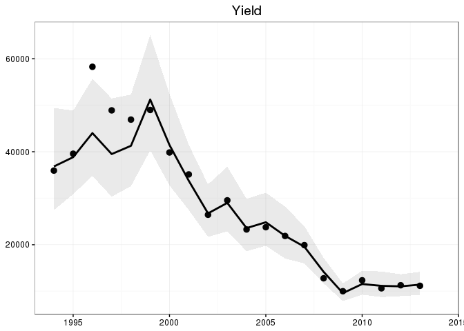

## Overview

Reads data from [www.stockassessment.org](www.stockassessment.org).

There are only two functions in this package:

* `get_sam`: Get a full copy of an assessment directory and stores it on the local computer. 
* `read_sam`: Reads the primary assessment results into R either directly from [www.stockassessment.org](www.stockassessment.org) or from a local directory. The functions returns a `list` that contains two data frames:

    * __rby__: Results by year, columns should be self explanatory for those familar with `sam` output.
    * __rbya__: Results by year and age with the following variables:
        * year
        * age
        * cW: Catch weights
        * dW: Discard weights
        * lW: Landings weights
        * sW: Stock weights
        * fL: Fraction landed
        * m:  Natural mortality
        * mat: Maturity
        * pF: Partial fishing mortality before spawning
        * pM: Partial natural mortality before spawning
        * n:  Stock in numbers
        * f:  Fishing mortality
        * oC: Observed catch
        * pC: Predicted catch
        * rC: Log catch residuals
        * oU1: Observed index 1
        * pU1: Predicted index 1
        * rU1: Log residuals of index 1
        * oU2: ...


## Installing


```r
devtools::install_github("einarhjorleifsson/ramsam")
```

## Examples

__Read only principle data from the web and return object to R__:

```r
library(dplyr)
```

```
## 
## Attaching package: 'dplyr'
## 
## The following objects are masked from 'package:stats':
## 
##     filter, lag
## 
## The following objects are masked from 'package:base':
## 
##     intersect, setdiff, setequal, union
```

```r
library(ramsam)
d <- read_sam(directory = "WBcod_2015_short", from_web = TRUE)
d$rby
```

```
## Source: local data frame [21 x 22]
## 
##      ssb ssb_std ssb_low ssb_hig  year   fbar fbar_std fbar_low fbar_hig
##    (dbl)   (dbl)   (dbl)   (dbl) (int)  (dbl)    (dbl)    (dbl)    (dbl)
## 1  29481  3943.5 21594.0 37368.0  1994 1.0372 0.109390 0.818420 1.255980
## 2  30400  3166.9 24066.2 36733.8  1995 1.1940 0.119420 0.955160 1.432840
## 3  38104  4030.6 30042.8 46165.2  1996 1.1194 0.095805 0.927790 1.311010
## 4  38210  4984.2 28241.6 48178.4  1997 1.1237 0.095138 0.933424 1.313976
## 5  26513  2575.6 21361.8 31664.2  1998 1.0996 0.097133 0.905334 1.293866
## 6  37067  3753.5 29560.0 44574.0  1999 1.2050 0.105170 0.994660 1.415340
## 7  39272  4621.9 30028.2 48515.8  2000 1.1693 0.100100 0.969100 1.369500
## 8  33923  3187.4 27548.2 40297.8  2001 1.2420 0.109170 1.023660 1.460340
## 9  26214  2537.8 21138.4 31289.6  2002 1.2203 0.108620 1.003060 1.437540
## 10 22121  2027.9 18065.2 26176.8  2003 1.0918 0.096837 0.898126 1.285474
## ..   ...     ...     ...     ...   ...    ...      ...      ...      ...
## Variables not shown: bio (dbl), bio_std (dbl), bio_low (dbl), bio_hig
##   (dbl), r (dbl), r_std (dbl), r_low (dbl), r_hig (dbl), yield (dbl),
##   yield_std (dbl), yield_low (dbl), yield_hig (dbl), oY (dbl)
```

```r
d$rbya
```

```
## Source: local data frame [168 x 22]
## 
##     year   age    cW    dW    fL    lW     m   mat    pF    pM    sW    oC
##    (int) (int) (dbl) (dbl) (dbl) (dbl) (dbl) (dbl) (dbl) (dbl) (dbl) (dbl)
## 1   1994     0 0.114 0.114 0.000 0.114 0.800  0.00     0     0 0.005    NA
## 2   1994     1 0.404 0.404 0.154 0.404 0.266  0.04     0     0 0.063  5611
## 3   1994     2 0.799 0.799 0.627 0.799 0.200  0.38     0     0 0.301  7677
## 4   1994     3 1.341 1.341 0.904 1.341 0.200  0.75     0     0 0.874 15886
## 5   1994     4 2.377 2.377 0.949 2.377 0.200  0.76     0     0 2.377  2285
## 6   1994     5 3.903 3.903 0.659 3.903 0.200  1.00     0     0 3.903   119
## 7   1994     6 4.851 4.851 0.480 4.851 0.200  1.00     0     0 4.851    38
## 8   1994     7 4.753 4.753 0.591 4.753 0.200  1.00     0     0 4.753    33
## 9   1995     0 0.044 0.044 0.000 0.044 0.800  0.00     0     0 0.005    NA
## 10  1995     1 0.358 0.358 0.158 0.358 0.286  0.04     0     0 0.063  4514
## ..   ...   ...   ...   ...   ...   ...   ...   ...   ...   ...   ...   ...
## Variables not shown: oU1 (dbl), oU2 (dbl), pC (dbl), pU1 (dbl), pU2 (dbl),
##   rC (dbl), rU1 (dbl), rU2 (dbl), n (dbl), f (dbl)
```

__Get a full copy of the directory onto local computer__:

```r
get_sam(directory = "WBcod_2015_short")
dir("WBcod_2015_short")
```
```
 [1] "baserun"            "conf"               "data"              
 [4] "index.html?C=D;O=A" "index.html?C=D;O=D" "index.html?C=M;O=A"
 [7] "index.html?C=M;O=D" "index.html?C=N;O=A" "index.html?C=N;O=D"
[10] "index.html?C=S;O=A" "index.html?C=S;O=D" "LO"                
[13] "log"                "make.R"             "Makefile"          
[16] "res"                "RETRO"              "run"               
[19] "SIM"                "src"                "test"     
```
Here one can then read data from local computer into R via:

```r
d <- read_sam(directory = "WBcod_2015_short", from_web = FALSE)
```

## Examples of some post-processing


```r
library(dplyr)
library(ggplot2)
d$rby %>%
  ggplot(aes(year, yield)) +
  geom_point(aes(y = oY)) +
  theme_bw() +
  geom_ribbon(aes(ymin = yield_low, 
                  ymax = yield_hig), 
              alpha=0.1) +  
  geom_line(lwd=1) +
  scale_colour_brewer(palette = "Set1") +
  labs(x = NULL, y = NULL, title = "Yield") +
  theme(legend.position = c(0.8,0.8))
```

 

```r
d$rby %>%
  ggplot(aes(year, ssb)) +
  theme_bw() +
  geom_ribbon(aes(ymin = ssb_low, 
                  ymax = ssb_hig), 
              alpha=0.1) +  
  geom_line(lwd=1) +
  scale_colour_brewer(palette = "Set1") +
  labs(x = NULL, y = NULL, title = "SSB") +
  theme(legend.position = c(0.8,0.8))
```

 

```r
d$rbya %>%
  select(year, age, rC, rU1, rU2) %>%
  tidyr::gather(variable, res, rC,rU1,rU2) %>%
  ggplot(aes(year, res)) +
  theme_bw() +
  geom_bar(stat = "identity") +
  facet_grid(age ~ variable) +
  labs(x = NULL, y = NULL, title = "Residuals") +
  theme(legend.position = c(0.8,0.8))
```

 
